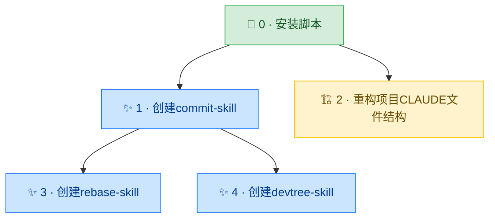

# 开发树

> 项目：claude-code-global | 最后更新：2026-04-19 | 共 5 轮

## 分类图例

| 图标 | 类型 | 说明 |
|------|------|------|
| 🌱 | 初建 | 某功能域首次从零建立 |
| ✨ | 功能 | 扩展用户可感知的能力 |
| 🐛 | 修复 | 纠正缺陷或回归 |
| 🏗️ | 重构 | 内部结构改善，用户行为不变 |
| 📦 | 工程 | 打包/CI/分发/工具链 |
| 🔬 | 探索 | 调研，可能被搁置 |

## 可视化

## 节点索引

| # | 名称 | 类型 | 父节点 | 一句话描述 |
|---|------|------|--------|-----------|
| 0 | 安装脚本 | 🌱 初建 | — | 通过符号链接将 CLAUDE.md 与 skills 部署到 ~/.claude/ |
| 1 | 创建commit-skill | ✨ 功能 | 0 | 创建 /commit skill，补全 /finish 流程的最后一环 |
| 2 | 重构项目CLAUDE文件结构 | 🏗️ 重构 | 0 | 分离全局规范与项目说明，解决 CLAUDE.md 语义错位 |
| 3 | 创建rebase-skill | ✨ 功能 | 1 | 创建 /rebase skill，诊断+分段引导本地分叉整理 |
| 4 | 创建devtree-skill | ✨ 功能 | 1 | 创建 /devtree skill，可视化开发树并集成到 /finish 流程 |
