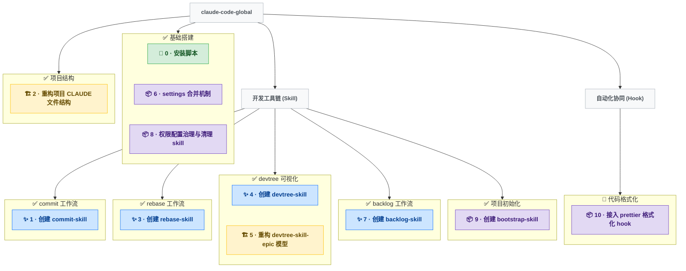

# 开发树

## 分类图例

| 图标 | 类型 | 说明                       |
| ---- | ---- | -------------------------- |
| 🌱   | 初建 | 某功能域首次从零建立       |
| ✨   | 功能 | 扩展用户可感知的能力       |
| 🐛   | 修复 | 纠正缺陷或回归             |
| 🏗️   | 重构 | 内部结构改善，用户行为不变 |
| 📦   | 工程 | 打包/CI/分发/工具链        |
| 🔬   | 探索 | 调研，可能被搁置           |

---

## 可视化

---

## 节点索引

> 最后更新：2026-04-26 | 共 11 轮

| #   | 名称                         | 类型    | 所属 Epic      | 一句话描述                                                                                                          |
| --- | ---------------------------- | ------- | -------------- | ------------------------------------------------------------------------------------------------------------------- |
| 0   | 安装脚本                     | 🌱 初建 | 基础搭建       | 通过符号链接将 CLAUDE.md 与 skills 部署到 ~/.claude/                                                                |
| 1   | 创建 commit-skill            | ✨ 功能 | commit 工作流  | 创建 /commit skill，补全 /finish 流程的最后一环                                                                     |
| 2   | 重构项目 CLAUDE 文件结构     | 🏗️ 重构 | 项目结构       | 分离全局规范与项目说明，解决 CLAUDE.md 语义错位                                                                     |
| 3   | 创建 rebase-skill            | ✨ 功能 | rebase 工作流  | 创建 /rebase skill，诊断+分段引导本地分叉整理                                                                       |
| 4   | 创建 devtree-skill           | ✨ 功能 | devtree 可视化 | 创建 /devtree skill，可视化开发树并集成到 /finish 流程                                                              |
| 5   | 重构 devtree-skill-epic 模型 | 🏗️ 重构 | devtree 可视化 | 引入 Epic 层，叶 Epic 为 subgraph 卡片，重构可视化方案                                                              |
| 6   | settings 合并机制            | 📦 工程 | 基础搭建       | install.sh 新增 settings.base.json 与本地 settings.json 的非破坏性合并（对象递归、数组并集）                        |
| 7   | 创建 backlog-skill           | ✨ 功能 | backlog 工作流 | 创建 /backlog skill，交互式扩写 + 归类后追加条目到 docs/BACKLOG.md                                                  |
| 8   | 权限配置治理与清理 skill     | 📦 工程 | 基础搭建       | 调研 CC 权限匹配规则，重写 settings.base.json，新增 /clean-local-setting skill，清理 5 项目 local 配置（257→54 条） |
| 9   | 创建 bootstrap-skill         | 📦 工程 | 项目初始化     | 新增 /bootstrap 处理空项目骨架（README/CLAUDE/DEVTREE），改 /devtree 支持冷启动，改 /start 加前置检查               |
| 10  | 接入 prettier 格式化 hook    | 📦 工程 | 代码格式化     | 新增全局 PostToolUse hook（.py/.md 编辑后自动格式化），bootstrap skill 增写 .prettierrc 与项目本地推荐配置约定      |

---

## Epic 结构

> 由作者手动维护。AI 只负责「可视化」和「节点索引」两个区块。

### 基础搭建

- 状态：已完成
- 轮次：0, 6, 8

### 项目结构

- 状态：已完成
- 轮次：2

### 开发工具链 (Skill)

#### commit工作流

- 状态：已完成
- 轮次：1

#### rebase工作流

- 状态：已完成
- 轮次：3

#### devtree可视化

- 状态：已完成
- 轮次：4, 5

#### backlog工作流

- 状态：已完成
- 轮次：7

#### 项目初始化

- 状态：已完成
- 轮次：9

### 自动化协同 (Hook)

#### 代码格式化

- 状态：进行中
- 轮次：10
