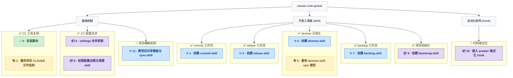

# 开发树

## 分类图例

| 图标 | 类型 | 说明                       |
| ---- | ---- | -------------------------- |
| 🌱   | 初建 | 某功能域首次从零建立       |
| ✨   | 功能 | 扩展用户可感知的能力       |
| 🐛   | 修复 | 纠正缺陷或回归             |
| 🏗️   | 重构 | 内部结构改善，用户行为不变 |
| 📦   | 工程 | 打包/CI/分发/工具链        |
| 🔬   | 探索 | 调研，可能被搁置           |

---

## 可视化

```mermaid
%%{init: {'flowchart': {'rankSpacing': 30, 'nodeSpacing': 20}}}%%
graph TD
  classDef genesis  fill:#d4edda,stroke:#28a745,color:#155724,font-weight:bold
  classDef feature  fill:#cce5ff,stroke:#0d6efd,color:#003d8f,font-weight:bold
  classDef bugfix   fill:#f8d7da,stroke:#dc3545,color:#721c24,font-weight:bold
  classDef refactor fill:#fff3cd,stroke:#ffc107,color:#664d03,font-weight:bold
  classDef infra    fill:#e2d9f3,stroke:#6f42c1,color:#3d1a78,font-weight:bold
  classDef research fill:#e2e3e5,stroke:#6c757d,color:#383d41,font-weight:bold
  classDef epic     fill:#f8f9fa,stroke:#adb5bd,color:#495057,font-weight:bold,font-size:15px

  ROOT["claude-code-global"]:::epic
  ROOT --> base["基础机制"]:::epic
  ROOT --> toolchain["开发工具链 (Skill)"]:::epic
  ROOT --> automation["自动化协同 (Hook)"]:::epic
  base --> e_cc_reuse
  base --> e_cc_merge
  base --> e_template
  toolchain --> e_commit
  toolchain --> e_rebase
  toolchain --> e_devtree
  toolchain --> e_backlog
  toolchain --> e_bootstrap
  automation --> e_format

  subgraph e_cc_reuse["✅ CC 工具复用"]
    direction TB
    N0["🌱 0 · 安装脚本"]:::genesis
    N2["🏗️ 2 · 重构项目 CLAUDE 文件结构"]:::refactor
    N0 ~~~ N2
  end

  subgraph e_cc_merge["✅ CC 配置合并"]
    direction TB
    N6["📦 6 · settings 合并机制"]:::infra
    N8["📦 8 · 权限配置治理与清理 skill"]:::infra
    N6 ~~~ N8
  end

  subgraph e_template["🔄 项目模板机制"]
    direction TB
    N11["✨ 11 · 跨项目共享模板与 sync-skill"]:::feature
  end

  subgraph e_commit["✅ commit 工作流"]
    direction TB
    N1["✨ 1 · 创建 commit-skill"]:::feature
  end

  subgraph e_rebase["✅ rebase 工作流"]
    direction TB
    N3["✨ 3 · 创建 rebase-skill"]:::feature
  end

  subgraph e_devtree["✅ devtree 可视化"]
    direction TB
    N4["✨ 4 · 创建 devtree-skill"]:::feature
    N5["🏗️ 5 · 重构 devtree-skill-epic 模型"]:::refactor
    N4 ~~~ N5
  end

  subgraph e_backlog["✅ backlog 工作流"]
    direction TB
    N7["✨ 7 · 创建 backlog-skill"]:::feature
  end

  subgraph e_bootstrap["✅ 项目初始化"]
    direction TB
    N9["📦 9 · 创建 bootstrap-skill"]:::infra
  end

  subgraph e_format["🔄 代码格式化"]
    direction TB
    N10["📦 10 · 接入 prettier 格式化 hook"]:::infra
  end
```

---

## 节点索引

> 最后更新：2026-04-27 | 共 12 轮

| #   | 名称                          | 类型    | 所属 Epic      | 一句话描述                                                                                                          |
| --- | ----------------------------- | ------- | -------------- | ------------------------------------------------------------------------------------------------------------------- |
| 0   | 安装脚本                      | 🌱 初建 | CC 工具复用    | 通过符号链接将 CLAUDE.md 与 skills 部署到 ~/.claude/                                                                |
| 1   | 创建 commit-skill             | ✨ 功能 | commit 工作流  | 创建 /commit skill，补全 /finish 流程的最后一环                                                                     |
| 2   | 重构项目 CLAUDE 文件结构      | 🏗️ 重构 | CC 工具复用    | 分离全局规范与项目说明，解决 CLAUDE.md 语义错位                                                                     |
| 3   | 创建 rebase-skill             | ✨ 功能 | rebase 工作流  | 创建 /rebase skill，诊断+分段引导本地分叉整理                                                                       |
| 4   | 创建 devtree-skill            | ✨ 功能 | devtree 可视化 | 创建 /devtree skill，可视化开发树并集成到 /finish 流程                                                              |
| 5   | 重构 devtree-skill-epic 模型  | 🏗️ 重构 | devtree 可视化 | 引入 Epic 层，叶 Epic 为 subgraph 卡片，重构可视化方案                                                              |
| 6   | settings 合并机制             | 📦 工程 | CC 配置合并    | install.sh 新增 settings.base.json 与本地 settings.json 的非破坏性合并（对象递归、数组并集）                        |
| 7   | 创建 backlog-skill            | ✨ 功能 | backlog 工作流 | 创建 /backlog skill，交互式扩写 + 归类后追加条目到 docs/BACKLOG.md                                                  |
| 8   | 权限配置治理与清理 skill      | 📦 工程 | CC 配置合并    | 调研 CC 权限匹配规则，重写 settings.base.json，新增 /clean-local-setting skill，清理 5 项目 local 配置（257→54 条） |
| 9   | 创建 bootstrap-skill          | 📦 工程 | 项目初始化     | 新增 /bootstrap 处理空项目骨架（README/CLAUDE/DEVTREE），改 /devtree 支持冷启动，改 /start 加前置检查               |
| 10  | 接入 prettier 格式化 hook     | 📦 工程 | 代码格式化     | 新增全局 PostToolUse hook（.py/.md 编辑后自动格式化），bootstrap skill 增写 .prettierrc 与项目本地推荐配置约定      |
| 11  | 跨项目共享模板与 sync-skill   | ✨ 功能 | 项目模板机制   | 新增 templates/<stack>/，扩展 /bootstrap 与新增 /sync-project-config，跨项目模板分发 + AI 智能 merge + marker 管理  |

---

## Epic 结构

> 由作者手动维护。AI 只负责「可视化」和「节点索引」两个区块。

### 基础机制

#### CC 工具复用

- 状态：已完成
- 轮次：0, 2

#### CC 配置合并

- 状态：已完成
- 轮次：6, 8

#### 项目模板机制

- 状态：进行中
- 轮次：11

### 开发工具链 (Skill)

#### commit工作流

- 状态：已完成
- 轮次：1

#### rebase工作流

- 状态：已完成
- 轮次：3

#### devtree可视化

- 状态：已完成
- 轮次：4, 5

#### backlog工作流

- 状态：已完成
- 轮次：7

#### 项目初始化

- 状态：已完成
- 轮次：9

### 自动化协同 (Hook)

#### 代码格式化

- 状态：进行中
- 轮次：10
