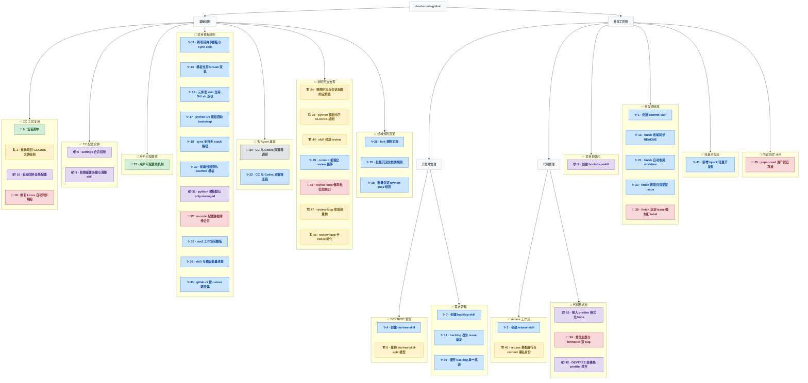

# 开发树

## 分类图例

| 图标 | 类型 | 说明 |
| - | - | - |
| 🌱 | 初建 | 某功能域首次从零建立 |
| ✨ | 功能 | 扩展用户可感知的能力 |
| 🐛 | 修复 | 纠正缺陷或回归 |
| 🏗️ | 重构 | 内部结构改善,用户行为不变 |
| 📦 | 工程 | 打包/CI/分发/工具链 |
| 🔬 | 探索 | 调研,可能被搁置 |

---

## 可视化


```mermaid
%%{init: {'flowchart': {'rankSpacing': 30, 'nodeSpacing': 20}}}%%
graph TD
  classDef genesis  fill:#d4edda,stroke:#28a745,color:#155724,font-weight:bold
  classDef feature  fill:#cce5ff,stroke:#0d6efd,color:#003d8f,font-weight:bold
  classDef bugfix   fill:#f8d7da,stroke:#dc3545,color:#721c24,font-weight:bold
  classDef refactor fill:#fff3cd,stroke:#ffc107,color:#664d03,font-weight:bold
  classDef infra    fill:#e2d9f3,stroke:#6f42c1,color:#3d1a78,font-weight:bold
  classDef research fill:#e2e3e5,stroke:#6c757d,color:#383d41,font-weight:bold
  classDef epic     fill:#f8f9fa,stroke:#adb5bd,color:#495057,font-weight:bold,font-size:15px

  ROOT["claude-code-global"]:::epic
  ROOT --> base["基础机制"]:::epic
  ROOT --> toolchain["开发工具链"]:::epic
  base --> e_cc_reuse
  base --> e_cc_merge
  base --> e_userconfig
  base --> e_template
  base --> e_multi_agent
  base --> e_constitution
  base --> e_rules
  toolchain --> e_bootstrap
  toolchain --> e_finish
  toolchain --> e_quick
  toolchain --> devmgmt["开发项管理"]:::epic
  toolchain --> codemgmt["代码管理"]:::epic
  devmgmt --> e_devtree
  devmgmt --> e_reqmgmt
  codemgmt --> e_rebase
  codemgmt --> e_format
  toolchain --> e_content

  subgraph e_cc_reuse["✅ CC 工具复用"]
    direction TB
    N0["🌱 0 · 安装脚本"]:::genesis
    N2["🏗️ 2 · 重构项目 CLAUDE 文件结构"]:::refactor
    N16["📦 16 · 自动同步全局配置"]:::infra
    N19["🐛 19 · 修复 Linux 自动同步缺陷"]:::bugfix
    N0 ~~~ N2
    N2 ~~~ N16
    N16 ~~~ N19
  end

  subgraph e_cc_merge["✅ CC 配置合并"]
    direction TB
    N6["📦 6 · settings 合并机制"]:::infra
    N8["📦 8 · 权限配置治理与清理 skill"]:::infra
    N6 ~~~ N8
  end

  subgraph e_userconfig["🔄 用户可配置项"]
    direction TB
    N27["🌱 27 · 用户可配置项机制"]:::genesis
  end

  subgraph e_template["🔄 项目模板机制"]
    direction TB
    N11["✨ 11 · 跨项目共享模板与 sync-skill"]:::feature
    N14["✨ 14 · 模板支持 GitLab 双轨"]:::feature
    N15["✨ 15 · 三件套 skill 支持 GitLab 双轨"]:::feature
    N17["✨ 17 · python-uv 模板自动 bootstrap"]:::feature
    N18["✨ 18 · sync 支持无 stack 路径"]:::feature
    N30["✨ 30 · 前端栈规则与 scaffold 模板"]:::feature
    N31["📦 31 · python 模板默认 only-managed"]:::infra
    N32["🐛 32 · vscode 配置落根跨栈合并"]:::bugfix
    N33["✨ 33 · ros2 工作空间模板"]:::feature
    N36["✨ 36 · skill 与模板批量清理"]:::feature
    N43["✨ 43 · gitlab-ci 按 runner 选变体"]:::feature
    N11 ~~~ N14
    N14 ~~~ N15
    N15 ~~~ N17
    N17 ~~~ N18
    N18 ~~~ N30
    N30 ~~~ N31
    N31 ~~~ N32
    N32 ~~~ N33
    N33 ~~~ N36
    N36 ~~~ N43
  end

  subgraph e_multi_agent["🔄 多 Agent 兼容"]
    direction TB
    N20["🔬 20 · CC 与 Codex 双兼容调研"]:::research
    N22["✨ 22 · CC 与 Codex 双兼容主链"]:::feature
    N20 ~~~ N22
  end

  subgraph e_constitution["🔄 全局宪法治理"]
    direction TB
    N24["🏗️ 24 · 精简宪法与会话标题约定排查"]:::refactor
    N25["🏗️ 25 · python 模板与子 CLAUDE 机制"]:::refactor
    N44["🏗️ 44 · skill 措辞 review"]:::refactor
    N45["✨ 45 · commit 前独立 review 循环"]:::feature
    N46["🐛 46 · review-loop 修两处实战缺口"]:::bugfix
    N47["🏗️ 47 · review-loop 收敛闸重构"]:::refactor
    N48["🏗️ 48 · review-loop 去 codex 简化"]:::refactor
    N24 ~~~ N25
    N25 ~~~ N44
    N44 ~~~ N45
    N45 ~~~ N46
    N46 ~~~ N47
    N47 ~~~ N48
  end

  subgraph e_rules["🔄 领域规则沉淀"]
    direction TB
    N28["✨ 28 · lark 规则文档"]:::feature
    N35["✨ 35 · 批量沉淀文档类规则"]:::feature
    N38["✨ 38 · 批量沉淀 python-ros2 规则"]:::feature
    N28 ~~~ N35
    N35 ~~~ N38
  end

  subgraph e_bootstrap["✅ 项目初始化"]
    direction TB
    N9["📦 9 · 创建 bootstrap-skill"]:::infra
  end

  subgraph e_finish["✅ 开发项收尾"]
    direction TB
    N1["✨ 1 · 创建 commit-skill"]:::feature
    N13["✨ 13 · finish 收尾同步 README"]:::feature
    N21["✨ 21 · finish 自动收尾 worktree"]:::feature
    N23["✨ 23 · finish 跨项目沉淀提 issue"]:::feature
    N26["🐛 26 · finish 沉淀 issue 强制打 label"]:::bugfix
    N1 ~~~ N13
    N13 ~~~ N21
    N21 ~~~ N23
    N23 ~~~ N26
  end

  subgraph e_quick["✅ 轻量开发流"]
    direction TB
    N41["✨ 41 · 新增 /quick 轻量开发流"]:::feature
  end

  subgraph e_devtree["✅ DEVTREE 管理"]
    direction TB
    N4["✨ 4 · 创建 devtree-skill"]:::feature
    N5["🏗️ 5 · 重构 devtree-skill-epic 模型"]:::refactor
    N4 ~~~ N5
  end

  subgraph e_reqmgmt["✅ 需求管理"]
    direction TB
    N7["✨ 7 · 创建 backlog-skill"]:::feature
    N12["✨ 12 · backlog 改为 issue 驱动"]:::feature
    N39["✨ 39 · 废弃 backlog 单一真源"]:::feature
    N7 ~~~ N12
    N12 ~~~ N39
  end

  subgraph e_rebase["✅ rebase 工作流"]
    direction TB
    N3["✨ 3 · 创建 rebase-skill"]:::feature
    N40["🏗️ 40 · rebase 静默直行与 commit 署名身份"]:::refactor
    N3 ~~~ N40
  end

  subgraph e_format["🔄 代码格式化"]
    direction TB
    N10["📦 10 · 接入 prettier 格式化 hook"]:::infra
    N34["🐛 34 · 修复主题与 formatter 双 bug"]:::bugfix
    N42["📦 42 · DEVTREE 表格免 prettier 对齐"]:::infra
    N10 ~~~ N34
    N34 ~~~ N42
  end

  subgraph e_content["🔄 内容创作 skill"]
    direction TB
    N29["🐛 29 · paper-read 资产就近存放"]:::bugfix
  end
```

---

## 节点索引

> 最后更新：2026-07-10 | 共 48 轮

| # | 名称 | 类型 | 所属 Epic | 一句话描述 |
| - | - | - | - | - |
| 0 | 安装脚本 | 🌱 初建 | CC 工具复用 | 通过符号链接将 CLAUDE.md 与 skills 部署到 ~/.claude/ |
| 1 | 创建 commit-skill | ✨ 功能 | 开发项收尾 | 创建 /commit skill，补全 /finish 流程的最后一环 |
| 2 | 重构项目 CLAUDE 文件结构 | 🏗️ 重构 | CC 工具复用 | 分离全局规范与项目说明，解决 CLAUDE.md 语义错位 |
| 3 | 创建 rebase-skill | ✨ 功能 | rebase 工作流 | 创建 /rebase skill，诊断+分段引导本地分叉整理 |
| 4 | 创建 devtree-skill | ✨ 功能 | DEVTREE 管理 | 创建 /devtree skill，可视化开发树并集成到 /finish 流程 |
| 5 | 重构 devtree-skill-epic 模型 | 🏗️ 重构 | DEVTREE 管理 | 引入 Epic 层，叶 Epic 为 subgraph 卡片，重构可视化方案 |
| 6 | settings 合并机制 | 📦 工程 | CC 配置合并 | install.sh 新增 settings.base.json 与本地 settings.json 的非破坏性合并（对象递归、数组并集） |
| 7 | 创建 backlog-skill | ✨ 功能 | 需求管理 | 创建 /backlog skill，交互式扩写 + 归类后追加条目到 docs/BACKLOG.md |
| 8 | 权限配置治理与清理 skill | 📦 工程 | CC 配置合并 | 调研 CC 权限匹配规则，重写 settings.base.json，新增 /clean-local-setting skill，清理 5 项目 local 配置（257→54 条） |
| 9 | 创建 bootstrap-skill | 📦 工程 | 项目初始化 | 新增 /bootstrap 处理空项目骨架（README/CLAUDE/DEVTREE），改 /devtree 支持冷启动，改 /start 加前置检查 |
| 10 | 接入 prettier 格式化 hook | 📦 工程 | 代码格式化 | 新增全局 PostToolUse hook（.py/.md 编辑后自动格式化），bootstrap skill 增写 .prettierrc 与项目本地推荐配置约定 |
| 11 | 跨项目共享模板与 sync-skill | ✨ 功能 | 项目模板机制 | 新增 templates/<stack>/，扩展 /bootstrap 与新增 /sync-project-config，跨项目模板分发 + AI 智能 merge + marker 管理 |
| 12 | backlog 改为 issue 驱动 | ✨ 功能 | 需求管理 | 把 backlog 工作流改为 GitHub Issue 真源（三轴 label + issue templates + Closes #N），引入 \_common 伪 stack 承载 stack-无关资源 |
| 13 | finish 收尾同步 README | ✨ 功能 | 开发项收尾 | /finish 末尾新增 Step 3.5（README review），命中触发清单则同步更新 README；本轮一次性补齐 README 基线（hooks / 模板 / 全量 skill 表 / BACKLOG 工作流） |
| 14 | 模板支持 GitLab 双轨 | ✨ 功能 | 项目模板机制 | \_common 与 python-uv 模板同时落 GitHub + GitLab 两套等价文件（issue templates + CI），bootstrap/sync 的 gh label create 按 origin 平台三分支判定 |
| 15 | 三件套 skill 支持 GitLab 双轨 | ✨ 功能 | 项目模板机制 | 新增 scripts/platform_issue.py helper（封装 gh ↔ glab 双轨调用），让 /backlog /start /finish /bootstrap /sync-project-config 在 GitLab 项目上等价可用 |
| 16 | 自动同步全局配置 | 📦 工程 | CC 工具复用 | scripts/auto-update.sh + scheduler/(launchd/systemd) + SessionStart hook 三位一体，多设备自动 git pull + install 并在 Claude 启动时反馈版本/更新 |
| 17 | python-uv 模板自动 bootstrap | ✨ 功能 | 项目模板机制 | bootstrap / sync adopt 在 python-uv stack 自动跑 uv init --bare + uv add --dev pytest pytest-cov ruff + pre-commit install，新项目即开即可 uv run pytest / git commit |
| 18 | sync 支持无 stack 路径 | ✨ 功能 | 项目模板机制 | /sync-project-config 放宽 `len(stacks) ≤ 1` 断言，adopt 加「无 stack（只 \_common）」选项，length=0 项目把 skipped 写在 marker 顶层，闭环可跑 |
| 19 | 修复 Linux 自动同步缺陷 | 🐛 修复 | CC 工具复用 | 修开发项 16 Linux 侧两缺陷：systemd timer 改 `OnCalendar=hourly` 解「燃尽」；auto-update.sh 加 untracked 撞名预检，归入「跳过」而非反复 git pull failed |
| 20 | CC 与 Codex 双兼容调研 | 🔬 探索 | 多 Agent 兼容 | 调研 Codex 配置约定与本仓库耦合度，确认 ~85% 内容 Agent-neutral，提出「单一真源 + install.sh 双轨」方案 A 并落 issue #8 |
| 21 | finish 自动收尾 worktree | ✨ 功能 | 开发项收尾 | /start 默认建独立 worktree、/finish 新增 Step 5 自动 rebase+FF merge+清理，工作流并行化；附 GLOBAL_CLAUDE.md 简述与 .claude/.gitignore |
| 22 | CC 与 Codex 双兼容主链 | ✨ 功能 | 多 Agent 兼容 | GLOBAL_AGENTS.md 改名 + skills 中性化 + 新增 codex.config.base.toml + install.sh 双轨重构（deploy_agent / merge_toml），单一真源部署到 ~/.claude 与 ~/.codex |
| 23 | finish 跨项目沉淀提 issue | ✨ 功能 | 开发项收尾 | /finish 新增「跨项目可沉淀流程反思」步，对跨项目资产候选可直接向 claude-code-global 跨仓库提 issue（不进 BACKLOG）；platform_issue.py 加 --repo；顺手把步骤编号重排为连续整数 |
| 24 | 精简宪法与会话标题约定排查 | 🏗️ 重构 | 全局宪法治理 | 精简 GLOBAL_AGENTS.md 冗余实现细节（删「会话标题约定」「项目本地推荐配置」两节、Backlog 节并入「核心开发模式 → 需求管理」），并查实会话标题由 ai-title 摘要器生成、Round 前缀机制上无效 |
| 25 | python 模板与子 CLAUDE 机制 | 🏗️ 重构 | 全局宪法治理 | 引入 `rules/<topic>.md` 领域规则文档机制（首例 `rules/python.md` 含 #12 七条 Python 风格 + 原 Python 章节），python-uv 模板接入 `uv init --package` 落标准 src 布局 + pytest fragment |
| 26 | finish 沉淀 issue 强制打 label | 🐛 修复 | 开发项收尾 | helper 对「跨仓库 `--repo` + 零 label」创建强制拦截（`--allow-no-label` 逃生）、`label-list` 支持 `--repo` 跨仓库校验；finish Step 3.5 加创建前 label 校验与「失败绝不丢 label」兜底；GLOBAL_AGENTS.md 补硬约束；回补 #12 三轴 label |
| 27 | 用户可配置项机制 | 🌱 初建 | 用户可配置项 | 引入扁平 env 用户配置（仓库外、user-wins seed、CC/Codex 共享），首例 git init 默认分支 → install.sh 设 git config --global init.defaultBranch；附 verify 脚本与 DESIGN 设计文档 |
| 28 | lark 规则文档 | ✨ 功能 | 领域规则沉淀 | 新增 rules/lark.md 领域规则文档（lark-cli 创作飞书云文档默认加 `⚡ Crafted with lark-cli` 署名行 + docx 实操技巧），GLOBAL_AGENTS.md 加并列指针节 |
| 29 | paper-read 资产就近存放 | 🐛 修复 | 内容创作 skill | paper-read skill 图片资产默认从「固定根目录 assets」改为「与笔记 markdown 同级 assets/」就近原则，引用用相对路径 |
| 30 | 前端栈规则与 scaffold 模板 | ✨ 功能 | 项目模板机制 | 新增 rules/frontend.md + templates/react-vite/ 前端 scaffold（React 19 + Vite 6 + TS strict + tailwind v4 + shadcn + Biome，npmmirror），bootstrap/sync 升级为多 stack 叠加 + stack.yml 自描述 path，前后端正交可同仓并存 |
| 31 | python 模板默认 only-managed | 📦 工程 | 项目模板机制 | python-uv 模板新增 `[tool.uv] python-preference=only-managed` fragment + install.sh 以 user-wins seed 系统级 `~/.config/uv/uv.toml`，让 uv 全权管 python、避免系统 python 缺 `Python.h` 致 C 扩展编译失败；rules/python.md §1 记坑 |
| 32 | vscode 配置落根跨栈合并 | 🐛 修复 | 项目模板机制 | 泛化 fragment 机制新增 `.vscode/*.json.fragment` 类，各 stack 编辑器配置合并进项目根 `.vscode/`（修 react-vite 落 `frontend/.vscode/`、打开仓库根 biome 推荐不触发）；react-vite settings 全语言作用域化防污染 Python；bootstrap/sync 加 JSON 合并 + 迁移去重 |
| 33 | ros2 工作空间模板 | ✨ 功能 | 项目模板机制 | 新增 templates/ros2/（合并 Python ament_python + C++ ament_cmake 参考包于单一 colcon 工作空间 stack，参考包落 src/）+ rules/ros2.md（ament-first CMake / 依赖消费导出 / 新增包检查清单），GLOBAL_AGENTS.md 加 ROS 2 指针段；据飞书《软件构建集成规范》沉淀通用约定 |
| 34 | 修复主题与 formatter 双 bug | 🐛 修复 | 代码格式化 | 修两个跨项目沉淀小 bug：react-vite 模板 theme-provider 暴露 resolvedTheme（修 system 模式按钮错乱 + matchMedia 实时跟随）；fix-after-edit.sh 的 ruff 加 `--unfixable F401`，分步 Edit 间不再误删未用 import（致 F821） |
| 35 | 批量沉淀文档类规则 | ✨ 功能 | 领域规则沉淀 | 一轮消化 8 条跨项目 type:docs issue：python.md 新增「打包·发布·安装」节（含前端产物 wheel 化 / 自托管 GitLab Registry / pip --target 删旧重装）、frontend.md（worktree 门禁备齐 node_modules + shadcn label htmlFor/id）、ros2.md 新增「Python/pip 依赖」节、新建 rules/shell.md（中文/全角 × shell 引号与变量名），GLOBAL_AGENTS.md 加 shell 指针 |
| 36 | skill 与模板批量清理 | ✨ 功能 | 项目模板机制 | 批量收 4 条 issue：新建 python-uv-workspace stack（uv workspace 多包单仓——虚拟根 + packages/\* 成员 + 跨成员 `workspace=true` 依赖），bootstrap/sync 加 workspace 分支（跳过 uv init、fragment 创建虚拟根、uv add --dev 写 dev group）+ rules/python.md §2.2 escape hatch（#20）；/finish 加 --no-merge/--keep-backup/--no-rebase 收尾选项（#13）；/start 编号识别跨 worktree 三源并集去重（#35）；#23 被 round 33 合一 ros2 stack 取代、随轮关闭 |
| 38 | 批量沉淀 python-ros2 规则 | ✨ 功能 | 领域规则沉淀 | 一轮消化 5 条跨项目 type:docs issue：rules/python.md 新增 §2.3（src 布局顶层同名目录遮蔽真包排障）/ §4 fixture 独立来源 / §5.4 应用内 uv tool 更新自检骨架 + §5.2 补 GitLab simple 查版本；rules/ros2.md §2 表加 ament_cmake_python 行 + §4.6 source-time hook（ament_environment_hooks）+ §5 双链路子节（同一 Python 包既作 uv 成员又作 colcon 包） |
| 39 | 废弃 backlog 单一真源 | ✨ 功能 | 需求管理 | 废弃 docs/BACKLOG.md、需求管理改为云端 issue 单一真源（open 项速览走按 priority 过滤的 saved query，「刻意不做」项归档为带 wontfix 的 closed issue）；改 backlog/finish/sync-project-config 三 skill + GLOBAL_AGENTS.md + README，sync 加老项目遗留 BACKLOG.md 一次性迁移节 |
| 40 | rebase 静默直行与 commit 署名身份 | 🏗️ 重构 | rebase 工作流 | /rebase 由「每阶段必停」改为「默认静默直行 + 必停清单」（无冲突近乎瞬间跑完，脏区 / 冲突 / FF 失败 / 公共分支 / push 才停，备份 tag 无条件必打）；commit/finish 的 Co-authored-by 按执行 Agent 自选身份（CC → Claude / Codex → OpenAI Codex），修 Codex 收尾误写 Claude |
| 41 | 新增 /quick 轻量开发流 | ✨ 功能 | 轻量开发流 | 新增单个 skill /quick 补齐「三档开发流」最轻一档：不落 docs / 不开 worktree / 不进计划模式，直接改代码 → 自动 /commit 收尾（复用其 lint 门禁与署名）；默认当前分支直接改，`--branch` 切轻量分支、`#<issue>` 可选带 Closes；GLOBAL_AGENTS.md 第 37 行做成三档流程权威指针 |
| 42 | DEVTREE 表格免 prettier 对齐 | 📦 工程 | 代码格式化 | 给 DEVTREE.md 加 .prettierignore 豁免 prettier 表格对齐（内容一变整列重排致 diff 爆炸），/devtree skill 改为生成紧凑单空格表格；模板 _common 同步一份给下游 |
| 43 | gitlab-ci 按 runner 选变体 | ✨ 功能 | 项目模板机制 | 引入通用「变体组」模板机制（文件名约定 `<target>.variant.<key>`，选择前移到 bootstrap/sync 交互、只落一份、记进 marker `variants`），把 python-uv 的 `.gitlab-ci.yml` 拆为 docker/shell 两变体（shell 版去 image + 脚本装 uv + 禁 !reference 用 YAML 锚点）；改 bootstrap/sync 两 skill + SCHEMA + 根 CLAUDE，含老项目「普通文件→变体组」迁移去重防误删 |
| 44 | skill 措辞 review | 🏗️ 重构 | 全局宪法治理 | 借 skill-creator 判据固化 6 条精简 rubric，对 8 份进 context 文档（5 skill + python/ros2 rules + GLOBAL_AGENTS）去冗余、零行为回归（净减 147 行，实删字数更多）；GLOBAL_AGENTS 孪生化 rules 指针折叠进汇总表（-48），labels helper 契约从三处下沉 scripts/platform_issue.md 单一真源，finish Step 6 下沉 references/readme-review.md |
| 45 | commit 前独立 review 循环 | ✨ 功能 | 全局宪法治理 | 新增 /review-loop skill + 宪法约定：commit 由 Agent 自主收口，提交前自动引入独立模型（审的模型≠写 diff 的模型才算独立，CC 写→codex 审）review 整树、迭代至 clean 才放行；含每 3 轮强制人工闸口、传已定前提给 codex、配置/指令文件不跳过、修复后重跑测试。用 review-loop 自举 review 自身实现约 20 轮，沉淀「纯策略文档 review 趋于无限、需人工闸口」等元经验 |
| 46 | review-loop 修两处实战缺口 | 🐛 修复 | 全局宪法治理 | 修 /review-loop 首次实战两缺口：调用改用 codex CLI 原生 `codex exec review`（绕开 `disable-model-invocation` 的 slash command）+ PROMPT 经临时文件 stdin 传入防注入；Step 6 自动修复按问题性质分流走 TDD 正序 + 假绿硬提醒；卸载 codex plugin 保留 CLI 本体。自举 review 3 轮抵人工闸口，暴露 codex 纠缠 corner case、信任边界待重新设计 |
| 47 | review-loop 收敛闸重构 | 🏗️ 重构 | 全局宪法治理 | 修 /review-loop 上线两病根（慢+审废基础功能）：收敛闸从「reviewer 说 clean」改为三要素并闸——(A) 运行验证（测试全绿+happy-path，排在 reviewer 意见之前，治「基础功能审废无人知」）+(B) 高置信过滤（对齐官方 ≥80，只报 file:line 证据+真会触发，治「无限挑 corner case」）+(C) 已定前提；reviewer 分层：默认走快而低噪的 CC `/code-review`、仅并发/难复现/跨模块 diff 才升级 codex（`--codex`/`--cc` 覆盖）。据 Karpathy/Osmani/anthropic 官方 plugin 三方调研，同步宪法+`/commit` |
| 48 | review-loop 去 codex 简化 | 🏗️ 重构 | 全局宪法治理 | 彻底拆除 codex-as-reviewer（判定链长、触发率近零、维护面外溢四文件），分层轴改为三条成本硬规则 + 两档：永远显式传档位（裸调会继承 session effort）、永远委派子 agent（review angle 是 inline 的，主会话直调会把整轮文件阅读永久写进主对话历史逐轮重发）、只用 `sonnet × medium`（默认，自带 1-vote verify）与 `opus × high`（并发/难复现硬 diff）两组合。读 CLI 二进制定位根因，顺带证伪三处旧断言（orchestrator/worker 扇出、Opus 有 verify、软链即刻生效）；人工闸口 3 轮收紧为 2 轮；grpc.aio 跨模型实证降格为「已知局限」保留。SKILL.md 194→137 行，畸形编号拉平；用新规则手动审自己，逮到委派模板漏必填 `description` 的真 bug |

---

## Epic 结构

> 由作者手动维护。AI 只负责「可视化」和「节点索引」两个区块。

### 基础机制

#### CC 工具复用

- 状态：已完成
- 轮次：0, 2, 16, 19

#### CC 配置合并

- 状态：已完成
- 轮次：6, 8

#### 用户可配置项

- 状态：进行中
- 轮次：27

#### 项目模板机制

- 状态：进行中
- 轮次：11, 14, 15, 17, 18, 30, 31, 32, 33, 36, 43

#### 多 Agent 兼容

- 状态：进行中
- 轮次：20, 22

#### 全局宪法治理

- 状态：进行中
- 轮次：24, 25, 44, 45, 46, 47, 48

#### 领域规则沉淀

- 状态：进行中
- 轮次：28, 35, 38

### 开发工具链

#### 项目初始化

- 状态：已完成
- 轮次：9

#### 开发项收尾

- 状态：已完成
- 轮次：1, 13, 21, 23, 26

#### 轻量开发流

- 状态：已完成
- 轮次：41

#### 开发项管理

##### DEVTREE 管理

- 状态：已完成
- 轮次：4, 5

##### 需求管理

- 状态：已完成
- 轮次：7, 12, 39

#### 代码管理

##### rebase工作流

- 状态：已完成
- 轮次：3, 40

##### 代码格式化

- 状态：进行中
- 轮次：10, 34, 42

#### 内容创作 skill

- 状态：进行中
- 轮次：29

```

```
