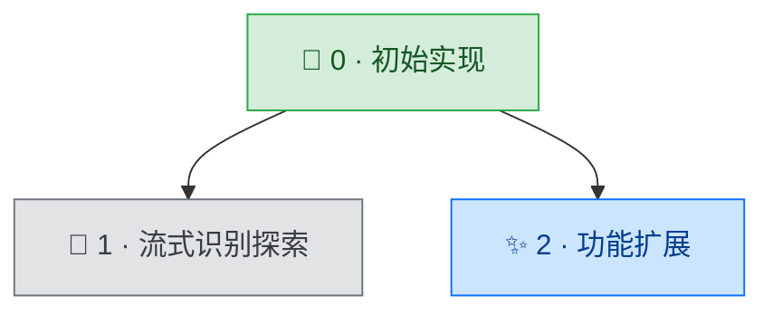

用户调用此 skill 表示需要更新（或从零构建）当前项目的开发树文档 `docs/DEVTREE.md`。

**参数处理**：可通过参数指定当前开发项编号（如 `/devtree 22`）。若无参数，自动识别 `docs/` 下编号最大的文件夹作为当前开发项。

---

## 分类体系

为每个开发项分配以下 6 类之一，依据 SUMMARY.md（或 PROMPT.md）的内容判断：

| 类型 | classDef 名 | 图标 | 判断标准 |
|------|-------------|------|---------|
| 初建 | genesis  | 🌱 | 某功能域首次从零建立 |
| 功能 | feature  | ✨ | 扩展用户可感知的能力 |
| 修复 | bugfix   | 🐛 | 纠正缺陷或回归 |
| 重构 | refactor | 🏗️ | 内部结构改善，用户行为不变 |
| 工程 | infra    | 📦 | 打包/CI/分发/工具链 |
| 探索 | research | 🔬 | 调研，可能被搁置或回退 |

## 父节点选择原则

- 每个节点只有一个父节点，保持严格的树结构
- 选「最直接的上游」：哪个开发项直接使能或驱动了本次开发
- **不按时间顺序强行构造父子关系**：并行的功能分支应追溯到共同的真正前序节点，而非上一个编号
- 若多个前序节点都有关联，选依赖最强的那一个作为父节点
- 项目第一个开发项为根节点，无父节点

---

## 执行步骤

### 第一步：确定当前开发项

- 若有参数，以参数指定的编号为准
- 否则，扫描 `docs/` 下所有形如 `数字-名称` 的文件夹，取编号最大者作为当前开发项

### 第二步：判断模式

- `docs/DEVTREE.md` **不存在** → 进入**重建模式**
- `docs/DEVTREE.md` **已存在** → 进入**增量模式**

### 第三步 A：重建模式

1. 扫描 `docs/` 下所有开发项文件夹（按编号升序排列）
2. 对每个开发项，优先读取 `SUMMARY.md`，若无则读取 `PROMPT.md`
3. 逐一分析，为每个开发项分配类型并确定父节点（编号最小的开发项为根节点，父节点为空）
4. 进入第四步，生成完整文档

### 第三步 B：增量模式

1. 读取现有 `docs/DEVTREE.md`，了解已有树结构和节点列表
2. 读取当前开发项的 `SUMMARY.md`（若无则读 `PROMPT.md`）
3. 为当前开发项分配类型并确定父节点
4. 在现有树的基础上追加当前节点，进入第四步

### 第四步：写入 docs/DEVTREE.md

按以下格式生成并写入文档（其中节点数据部分用真实内容替换示例）：

````markdown
# 开发树

> 项目：{项目名} | 最后更新：{今日日期} | 共 {N} 轮

## 分类图例

| 图标 | 类型 | 说明 |
|------|------|------|
| 🌱 | 初建 | 某功能域首次从零建立 |
| ✨ | 功能 | 扩展用户可感知的能力 |
| 🐛 | 修复 | 纠正缺陷或回归 |
| 🏗️ | 重构 | 内部结构改善，用户行为不变 |
| 📦 | 工程 | 打包/CI/分发/工具链 |
| 🔬 | 探索 | 调研，可能被搁置 |

## 可视化



## 节点索引

| # | 名称 | 类型 | 父节点 | 一句话描述 |
|---|------|------|--------|-----------|
| 0 | 初始实现 | 🌱 初建 | — | （一句话描述本轮核心成果） |
| 1 | 流式识别探索 | 🔬 探索 | 0 | （一句话描述本轮核心成果） |
| 2 | 功能扩展 | ✨ 功能 | 0 | （一句话描述本轮核心成果） |
````

**格式规范**：
- 节点 ID：`N{编号}`，如 `N0`、`N22`
- 节点标签：`"{图标} {编号} · {文件夹中文名}"`（去掉编号前缀，只保留中文名）
- 样式类：`:::{classDef名}`
- 边：`N{父编号} --> N{子编号}`（每条边单独一行，根节点无入边）
- 节点索引表中父节点列：根节点填 `—`，其余填父节点编号
