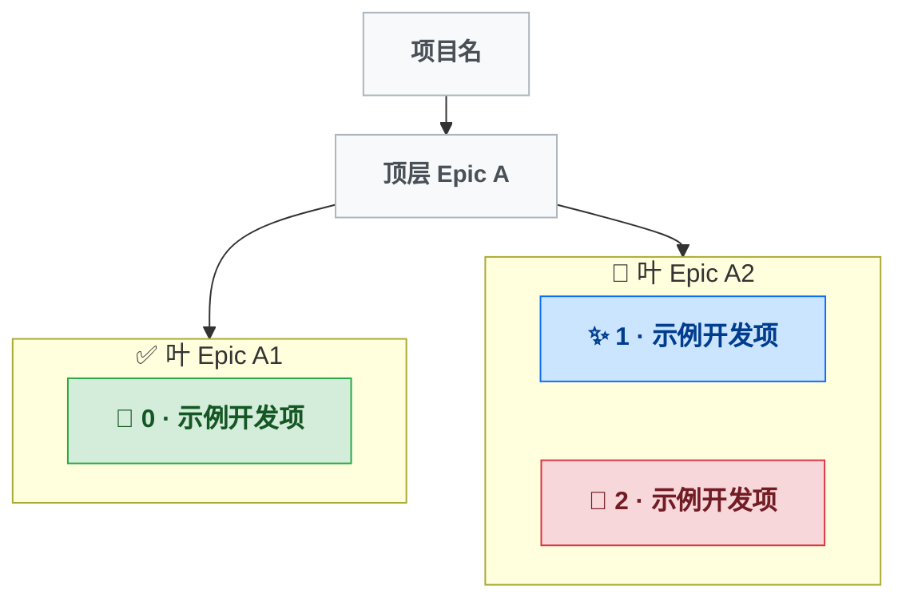

用户调用此 skill 表示 Epic 结构已更新，需要同步「可视化」和「节点索引」两个区块。

---

## 核心原则：每次都从 Epic 结构完全重建

**「Epic 结构」区块是单一事实来源。「可视化」和「节点索引」每次调用本 skill 时都必须被完全重建，不允许增量修补、不允许从旧图里复制结构。**

执行流程：
1. 读取并解析「Epic 结构」区块
2. **丢弃**现有「可视化」与「节点索引」区块的全部内容（它们是从上次 Epic 结构渲染的过时产物）
3. **只从**当前「Epic 结构」 + 各开发项 SUMMARY.md 重新构造两个区块
4. 整块替换写回

如果旧「节点索引」表里有某开发项的「一句话描述」且该开发项在新 Epic 结构中仍存在，可以复用这一行描述（避免重新读 SUMMARY.md），但层级/归属一律以新 Epic 结构为准。

---

## docs/DEVTREE.md 文件结构

文件分为三个区块，职责严格分离：

| 区块 | 维护者 | 说明 |
|------|--------|------|
| **Epic 结构** | 作者手动维护 | Markdown 树形列表，定义目标层次和每个叶 Epic 包含的开发项编号 |
| **可视化** | AI 维护 | Mermaid 图，每次从 Epic 结构完全重建 |
| **节点索引** | AI 维护 | 所有开发项的分类与 Epic 归属表，每次从 Epic 结构完全重建 |

**AI 不得修改「Epic 结构」区块。** 只整块替换「可视化」和「节点索引」两个区块的内容。

---

## Epic 结构规范

作者在「Epic 结构」区块中用 Markdown 标题层级定义目标树：

- 非叶 Epic（中间节点）：只有子目标，没有「状态」和「轮次」
- 叶 Epic（最底层目标）：有「状态」和「轮次」字段
  - 状态取值：`已完成` / `进行中` / `已放弃`
  - 轮次：逗号分隔的开发项编号列表
- 同一叶 Epic 内的开发项是**并列关系**，没有层次，没有先后

---

## 开发项分类体系

为每个开发项分配以下 6 类之一，依据 SUMMARY.md（或 PROMPT.md）内容判断：

| 类型 | classDef 名 | 图标 | 判断标准 |
|------|-------------|------|---------|
| 初建 | genesis  | 🌱 | 某功能域首次从零建立 |
| 功能 | feature  | ✨ | 扩展用户可感知的能力 |
| 修复 | bugfix   | 🐛 | 纠正缺陷或回归 |
| 重构 | refactor | 🏗️ | 内部结构改善，用户行为不变 |
| 工程 | infra    | 📦 | 打包/CI/分发/工具链 |
| 探索 | research | 🔬 | 调研，可能被搁置或回退 |

---

## 执行步骤

### 第一步：解析 Epic 结构（唯一事实来源）

读取 `docs/DEVTREE.md` 的「Epic 结构」区块，提取：
- Epic 的层次关系（哪些是中间节点，哪些是叶）
- 每个叶 Epic 的名称、状态、所含开发项编号列表

从这一步得到的数据模型是后续生成的**唯一依据**。不要回看旧「可视化」或旧「节点索引」去推断结构。

### 第二步：为每个开发项确定分类

遍历「Epic 结构」中列出的所有开发项编号：
- 若该编号已在旧「节点索引」表中，直接复用其类型和一句话描述
- 否则读取 `docs/{编号}-*/SUMMARY.md`（若无则读 `PROMPT.md`）分配类型、写一句话描述

### 第三步：从零生成「可视化」区块

Mermaid 格式规范：

- 整体是一棵有根树，用有向边（`-->`）表达 Epic 层级关系
- 根节点：`ROOT["{项目目录名}"]:::epic`（由 AI 根据项目上下文推断）
- **非叶 Epic**：普通节点 `{id}["{名称}"]:::epic`，通过 `-->` 边与父节点连接
  - id 用英文缩写，如 `pd`、`ea`、`cross`
- **叶 Epic**：`subgraph {id}["{状态图标} {名称}"]` 容器，内部声明 `direction TB`，通过 `-->` 边从父节点指向 subgraph id
  - 状态图标：✅ 已完成 / 🔄 进行中 / ❌ 已放弃
- 开发项节点放在所属叶 Epic 的 subgraph 内，节点之间用 `~~~`（不可见链接）强制纵向堆叠，不画有向边
- 开发项格式：`N{编号}["{类型图标} {编号} · {文件夹中文名}"]:::{classDef名}`
- 新增 `classDef epic fill:#f8f9fa,stroke:#adb5bd,color:#495057` 用于 Epic 节点配色

### 第四步：从零生成「节点索引」区块

按编号升序排列，每行包含：编号、名称、类型、所属叶 Epic、一句话描述。「所属 Epic」列**必须**与第一步解析出的 Epic 结构一致，不得沿用旧索引中的归属。

---

## 输出格式模板

````markdown
## Epic 结构

（此区块由作者维护，AI 原样保留）

## 分类图例

| 图标 | 类型 | 说明 |
|------|------|------|
| 🌱 | 初建 | 某功能域首次从零建立 |
| ✨ | 功能 | 扩展用户可感知的能力 |
| 🐛 | 修复 | 纠正缺陷或回归 |
| 🏗️ | 重构 | 内部结构改善，用户行为不变 |
| 📦 | 工程 | 打包/CI/分发/工具链 |
| 🔬 | 探索 | 调研，可能被搁置 |

## 可视化



## 节点索引

> 最后更新：{今日日期} | 共 {N} 轮

| # | 名称 | 类型 | 所属 Epic | 一句话描述 |
|---|------|------|----------|-----------|
| 0 | 示例开发项 | 🌱 初建 | 叶 Epic A1 | （一句话描述） |
| 1 | 示例开发项 | ✨ 功能 | 叶 Epic A2 | （一句话描述） |
| 2 | 示例开发项 | 🐛 修复 | 叶 Epic A2 | （一句话描述） |
````
